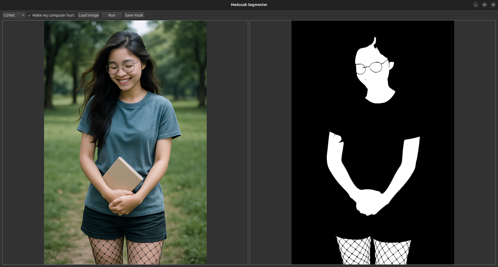

# medusab-segmenter

Because skin segmentation is laborious.

Grab the latest release from the [releases](https://github.com/83catsonthemoon/medusab-segmenter/releases) tab



## Development Requirements

### Requirements

Linux:
```bash
build-essential cmake ninja-build qt6-base-dev
```

Windows
```ps
choco install qt6-base-dev
```

ONNX Runtime:

Grab the [latest release](https://github.com/microsoft/onnxruntime/releases) for your platform.

#### CUDA

If you're on Linux, make sure you've got the typical CUDA drivers and such if you are using an NVIDIA GPU, including `libcudnn`.

```bash
wget https://developer.download.nvidia.com/compute/cuda/repos/ubuntu2404/x86_64/cuda-keyring_1.1-1_all.deb
sudo dpkg -i cuda-keyring_1.1-1_all.deb
sudo apt update
sudo apt install libcudnn9-cuda-12
sudo ldconfig
```

For Windows, this project now uses the Windows ML package instead of the
standalone ONNX Runtime GPU zip. That gives the app the ONNX Runtime shipped
with Windows ML plus the included DirectML provider, which is a better fit for
Windows deployment than manually carrying CUDA runtime dependencies.

### Build

#### Linux

```bash
cmake -S . -B build -DONNXRUNTIME_ROOT=onnxruntime-linux-x64-gpu-1.25.0
cmake --build build
```

#### Windows 

Windows ML currently assumes a modern MSVC/Windows App SDK toolchain.

```ps
cmake -S . -B build -G "Visual Studio 17 2022" -A x64 `
  -DCMAKE_PREFIX_PATH="C:/Qt/6.4.2/msvc2019_64" `
  -DWINDOWS_ML_DIR="C:/packages/Microsoft.WindowsAppSDK.ML/build/cmake"
```

If both Qt and Windows ML need to come from `CMAKE_PREFIX_PATH`, pass them as a
semicolon-separated list.
